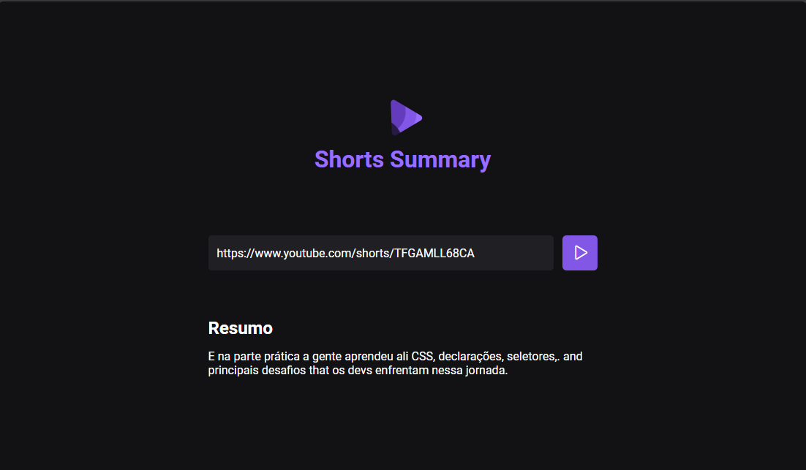

# Shorts summary

Este repositório contém o projeto Shorts Summary, um site que realiza a conversão de vídeos Shorts do YouTube para texto e depois faz o resumo do conteúdo do vídeo. 
O objetivo do projeto foi criar uma aplicação Full Stack Web utilizando o modelo da OpenAI de reconhecimento automático de fala (ASR - Automatic Speech Recognition), trabalhando assim o processamento 
de linguagem natural (PLN) uma área da inteligência artificial (IA) que se concentra em como as máquinas podem entender a linguagem humana. Essa tecnologia permite que as máquinas processem, interpretem 
e gerem a linguagem humana de maneira semelhante a como os humanos fazem.

## Como utilizar?
### - GitHub
Clique em `Code` e depois em `Download zip`. Descompacte o arquivo e abra com sua IDE de preferência. Recomendado VScode.

### - Terminal
Em seguida abra o terminal e execute o comando `npm i` para instalar todas as dependências necessárias para execução do projeto.
Para excutar o servido Node, insira o script `npm run server` e para executar o projeto web `npm run web`.

### - Youtube
No site do Youtube, selecione um vídeo Shorts que você queira resumir o conteúdo. Copie a URL do vídeo e insira no campo de busca do site Shorts Summary. Pressione o botão para que seja iniciada a busca do vídeo, 
sua transcrição e posterior resumo. Dentro de alguns segundos será exibido o resumo do vídeo.

## Para Desktop

## Tecnologias

- HTML
- CSS
- JavaScript
- Vite
- Node JS
- Axios
- Git and Github

## Modelos de IA utilizados
- Whisper - Modelo da OpenAI para reconhecimento automático de fala (ASR - Automatic Speech Recognition), responsável pela extração e transcrição do áudio.
- Bart - Modelo para resumo de texto.
- Transformers.js - Biblioteca que permite utilizar modelos de IA no navegador e servidor com JavaScript. Fornece modelos pré-treinados para realizar diversas tarefas.